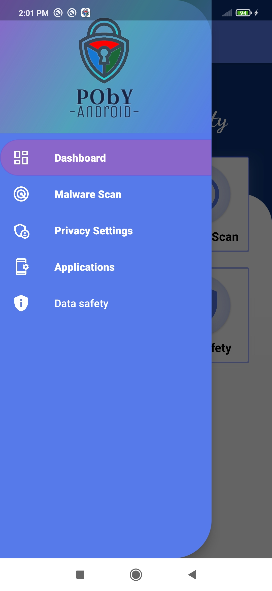
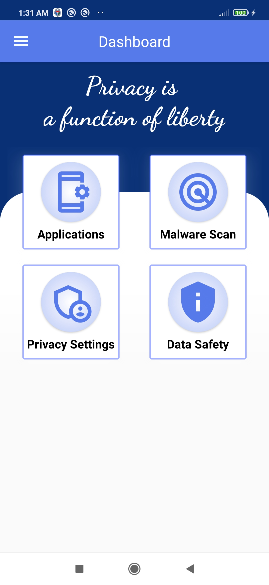
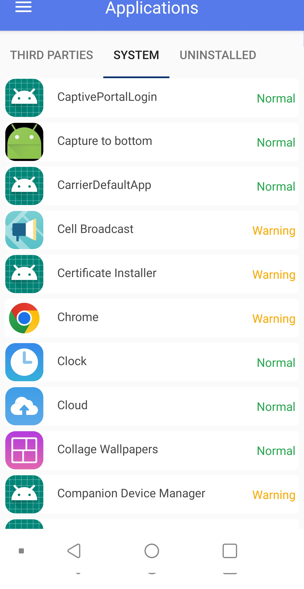
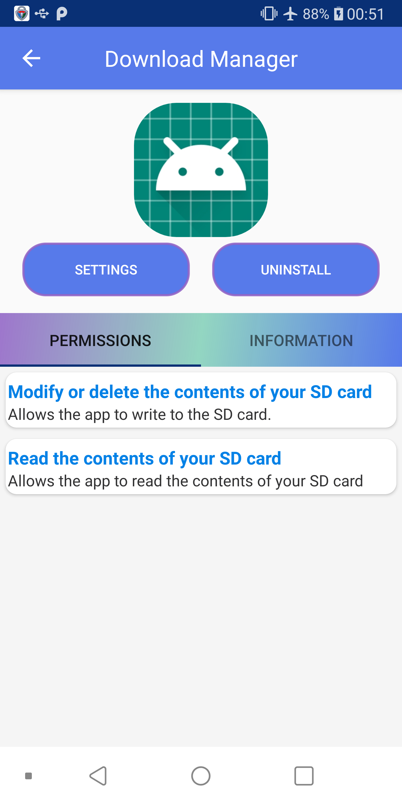
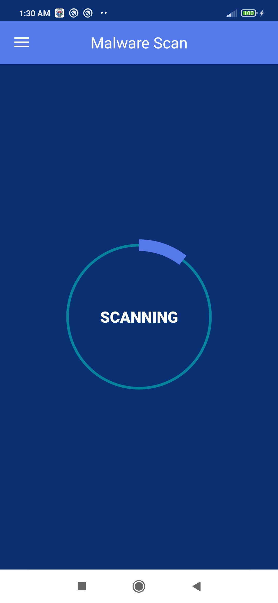
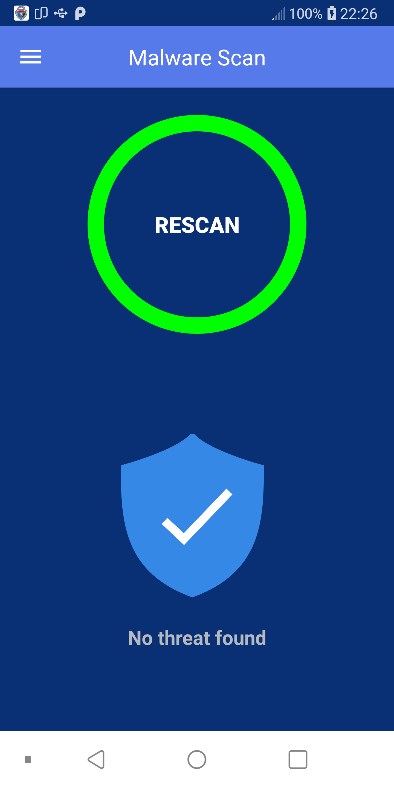
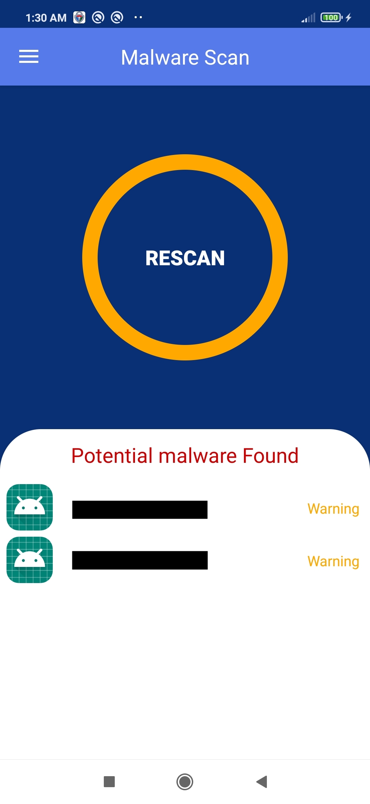
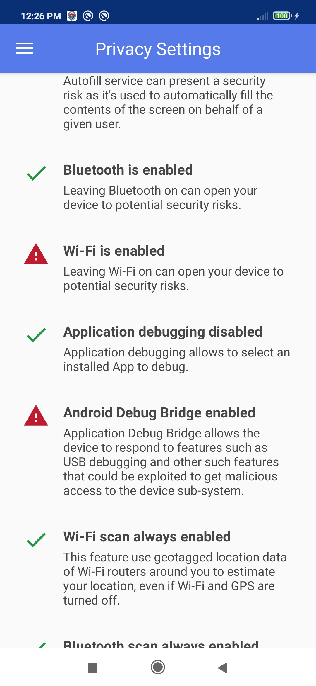
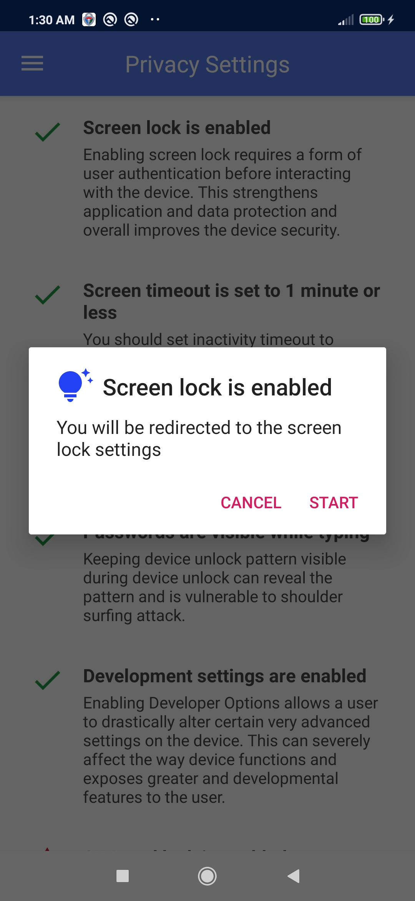

# PObY-A
PObY-A, Privacy Owned by You - Android, is an application which aim to help Android users to improve security and privacy of their devices.

## Features

| PObY-A Features                                                |     |
|----------------------------------------------------------------|-----|
| 🚫 No Ads or Purchases                                         | ✅   |
| 📙 Translations (FR & EN)                                      | ✅   |
| 🪲 Malware scan                                                | ✅   |
| ⏱️ Live monitoring (install/uninstall)                         | ✅   |
| 🔐 Enforce settings privacy based on some CIS* recommendations | ✅   |
| ⚠️ Warn apps with dangerous* permissions                       | ✅   |
| ⚡ Many more coming...                                          | ✅   |

**CIS:** Center of Internet Security

**dangerous**: "A higher-risk permission that would give a requesting application access to private user data or control over the device that can negatively impact the user" [permission element](https://developer.android.com/guide/topics/manifest/permission-element)

## Supported Android versions
**8.0 (API 26) to 12 (API 31)**

## Needed permissions
- Write system settings
- "force-lock" admin permission
- Bluetooth permission: needed to automate disable bluetooth
- Foreground service permission: needed for live monitoring

## Screnshots

        
        
        
        
        
        
        
        
        

