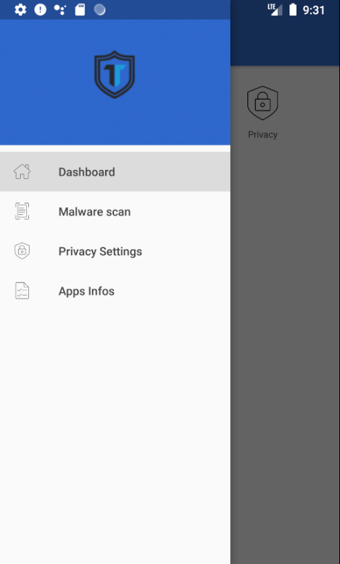

# PObY-A (Beta)
Privacy Owned by You - Android (Beta).

## Features
- Checks and help to enforce settings privacy
- List installed applications and list their granted permissions
- Malware scan using the same database as [AMDH](https://github.com/secthetech/AMDH) 

## Needed permissions
- Write system settings
- "force-lock" admin permission  

## Screnshots
 
 
 
 