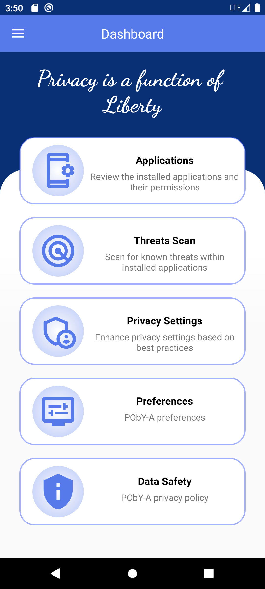
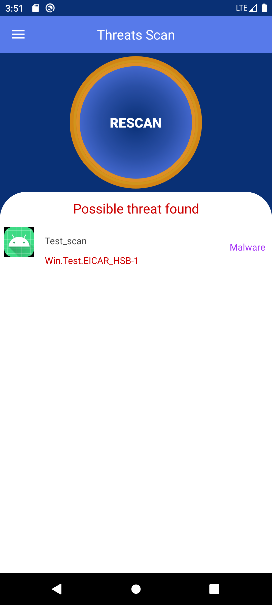
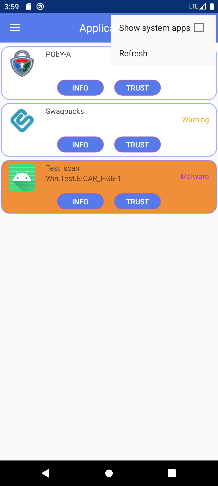
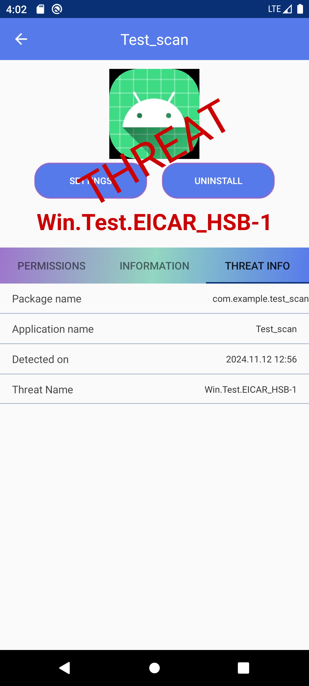
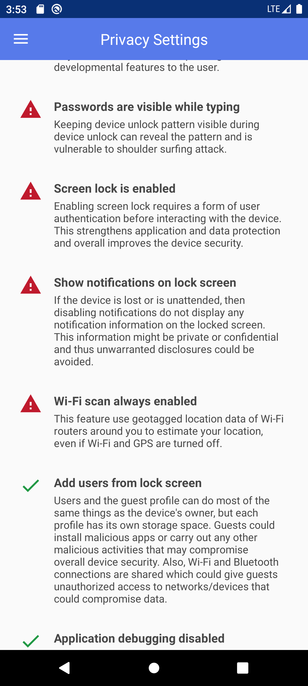
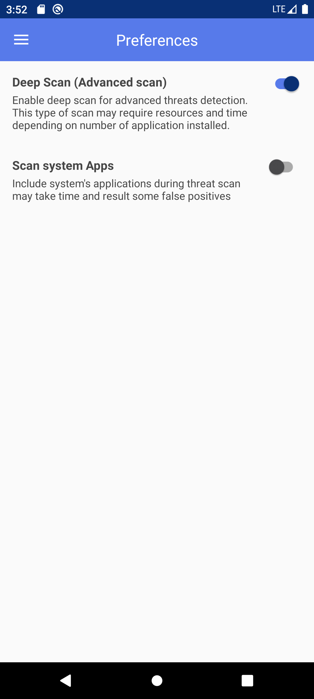

# PObY-A
PObY-A, Privacy Owned by You - Android, is a security and privacy application for Android devices to improve security and privacy of their devices. It uses ClamAV database to scan for malware and warn users about apps with dangerous permissions. It also enforces some settings based on CIS recommendations.

Malware scan is offline and based on two databases:
- ClamAV database, which is updated daily. The app will download the database when it is outdated.
- PObY-A database, managed by ICTrust.

## Features

| PObY-A Features                                                |   |
|----------------------------------------------------------------|---|
| 🚫 No Ads or Purchases                                         | ✅ |
| 📙 Translations (FR & EN)                                      | ✅ |
| 🪲 Malware scan                                                | ✅ |
| 🛡️ CVD: ClamAV database integration                           | ✅ |
| 🔐 Enforce settings privacy based on some CIS* recommendations | ✅ |
| ⚠️ Warn apps with dangerous* permissions                       | ✅ |
| ⚡ Many more coming...                                          | ✅ |

**CIS:** Center for Internet Security

**dangerous**: "A higher-risk permission that would give a requesting application access to private user data or control over the device that can negatively impact the user" [permission element](https://developer.android.com/guide/topics/manifest/permission-element)

## Supported Android versions
**8.0 (API 26) to 13 (API 34)**

## Needed permissions
- Write system settings
- "force-lock" admin permission
- External Storage

## Screenshots

        
        
        
        
        
        
        
        
        
        

## Disclaimer
ICTrust is not affiliated with ClamAV.

