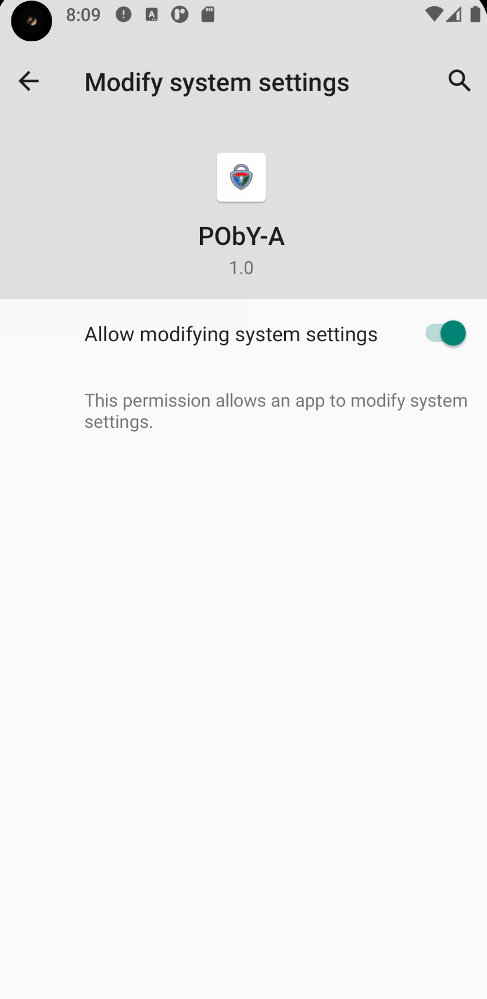

# PObY-A
PObY-A, Privacy Owned by You - Android, is an application which aim to help Android users to improve security and privacy of their devices.

## Features
- Check and help to enforce settings privacy based on some CIS (Center of Internet Security) recommendations
- List installed applications and list their granted permissions
- Malware scan using the same database as [AMDH](https://github.com/a-yatta/AMDH)

## Needed permissions
- Write system settings
- "force-lock" admin permission

## Screnshots
 
 
 
 
 
 
 
 
 
 